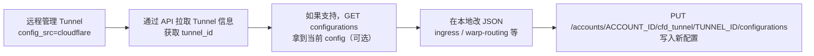

**好，这次直接说 API 的做法。**

**核心结论：**

- 远程管理的 Cloudflare Tunnel（`config_src = cloudflare`）的配置（Public
  Hostname / Ingress 等）就是一个“云端配置对象”。
- 修改云端配置的官方 API 是：
  - `PUT /accounts/{account_id}/cfd_tunnel/{tunnel_id}/configurations`
- 每次都是用 JSON 体把整个 `config.ingress` 等一次性提交，Cloudflare
  用这个新的配置替换掉之前的【turn15fetch0】。

下面一步一步给你实战可用的示例。

---

## 一、整体流程示意

先看下从“查看现有配置”到“改完再写回”的流程：



关键点就是最后那个 `PUT .../configurations` 的调用【turn15fetch0】。

---

## 二、准备：账号 ID、Tunnel ID 和 API Token

1）拿到 ACCOUNT_ID

- 在 Zero Trust Dashboard 的 URL 里就能看到，类似：
  - `https://dash.cloudflare.com/<ACCOUNT_ID>/...`
- `ACCOUNT_ID` 就是一串 32 位的 hex 字符串。

2）拿到 TUNNEL_ID

- 方式 1：在 Dashboard 里打开这个 Tunnel，URL 里会出现 ID；
- 方式 2：用 API 列出 Tunnel，官方文档里给了 GET 示例【turn15fetch0】：
  - `curl "https://api.cloudflare.com/client/v4/accounts/$ACCOUNT_ID/cfd_tunnel/<tunnel-id>" --request GET --header "Authorization: Bearer $CLOUDFLARE_API_TOKEN"`

  （文档示例里直接写死了 ID，你在实际使用时可以先用 list 接口或者 Dashboard
  看到具体 ID。）

3）创建正确的 API Token

文档明确说：更新 Tunnel 配置需要以下权限之一【turn15fetch0】：

- `Cloudflare One Connectors Write`
- `Cloudflare One Connector: cloudflared Write`
- `Cloudflare Tunnel Write`

同时，如果你还要顺带创建 DNS 记录，还需要 `DNS Write`【turn15fetch0】。

建议：

- 手工在 My Profile → API Tokens 新建一个 token；
- 模板选“Custom”，勾选：
  - Account → Cloudflare Tunnel → Edit（对应 `Cloudflare Tunnel Write`）
  - Zone → DNS → Edit（如果你要用 API 新增 CNAME）

记下这个 token，设到环境变量：

```bash
export CLOUDFLARE_API_TOKEN="你的_token"
export ACCOUNT_ID="你的_account_id"
export TUNNEL_ID="你的_tunnel_id"
```

---

## 三、更新 Tunnel 配置的官方 API 示例（核心）

Cloudflare 官方文档“Create a remote tunnel (API)”里，第 3a 步就是通过 API 修改
tunnel 的配置（ingress 等），完整的 curl 示例如下【turn15fetch0】：

```bash
curl "https://api.cloudflare.com/client/v4/accounts/$ACCOUNT_ID/cfd_tunnel/$TUNNEL_ID/configurations" \
  --request PUT \
  --header "Authorization: Bearer $CLOUDFLARE_API_TOKEN" \
  --json '{
    "config": {
      "ingress": [
        {
          "hostname": "app.example.com",
          "service": "http://localhost:8001",
          "originRequest": {}
        },
        {
          "service": "http_status:404"
        }
      ]
    }
  }'
```

几个要点：

- URL：`/accounts/{account_id}/cfd_tunnel/{tunnel_id}/configurations`
- Method：`PUT`
- Body 结构：
  - 顶层 key 是 `config`
  - `config.ingress` 是数组，每个元素对应一条 Public Hostname / Ingress 规则
  - 最后一条是兜底规则（`service: http_status:404` 等）【turn15fetch0】
- 文档说明：
  - 你必须有一个“catch-all”规则，这里用 `http_status:404` 举例【turn15fetch0】；
  - 如果是多级子域，需要订购高级证书【turn15fetch0】。

你只要把 `ingress` 数组改成你想要的，就能直接改“云端配置”。

---

## 四、一个更完整的示例：增加/修改多个 Public Hostname

假设你想给这个 Tunnel 配三个服务：

- `app1.example.com` -> `http://10.0.0.1:8001`
- `app2.example.com` -> `http://10.0.0.2:8002`
- `*.app3.example.com` -> `http://10.0.0.3:8003`

curl 示例：

```bash
curl "https://api.cloudflare.com/client/v4/accounts/$ACCOUNT_ID/cfd_tunnel/$TUNNEL_ID/configurations" \
  --request PUT \
  --header "Authorization: Bearer $CLOUDFLARE_API_TOKEN" \
  --json '{
    "config": {
      "ingress": [
        {
          "hostname": "app1.example.com",
          "service": "http://10.0.0.1:8001",
          "originRequest": {
            "noTLSVerify": true
          }
        },
        {
          "hostname": "app2.example.com",
          "service": "http://10.0.0.2:8002",
          "originRequest": {}
        },
        {
          "hostname": "*.app3.example.com",
          "service": "http://10.0.0.3:8003",
          "originRequest": {}
        },
        {
          "service": "http_status:404"
        }
      ]
    }
  }'
```

注意：

- 这会“整体替换” tunnel 的配置，不是增量更新。
- 所以要确保：
  - 想保留的旧规则也要带进去；
  - 一定保留最后一条 catch-all。

---

## 五、如果需要 Private Network（虚拟网络）呢？

如果是把某个内网网段通过 Tunnel 连到 Zero Trust（类似以前的 Private
Network），那属于另一类资源：`teamnet/routes`，对应 curl 示例在文档 3b
步【turn15fetch0】：

```bash
curl "https://api.cloudflare.com/client/v4/accounts/$ACCOUNT_ID/teamnet/routes" \
  --request POST \
  --header "Authorization: Bearer $CLOUDFLARE_API_TOKEN" \
  --json '{
    "network": "172.16.0.0/16",
    "tunnel_id": "c1744f8b-faa1-48a4-48e5c-02ac921467fa",
    "comment": "Example private network route"
  }'
```

- `tunnel_id` 就是你这个远程 tunnel 的 UUID；
- 这个接口跟 `/configurations` 是分开的，属于 Zero Trust > Networks > Routes
  资源。

也就是说：

- “Public hostname / Ingress 规则”：用
  `/cfd_tunnel/{tunnel_id}/configurations`（PUT）【turn15fetch0】
- “Private network 路由”：用 `/teamnet/routes`（POST/DELETE）【turn15fetch0】

---

## 六、顺便：DNS 记录也可以用 API 加

要让外网能访问 `app1.example.com`，还要在 Cloudflare 里创建一个 CNAME 指向这个
Tunnel 的子域名 `<tunnel-id>.cfargotunnel.com`。

官方示例【turn15fetch0】：

```bash
curl "https://api.cloudflare.com/client/v4/zones/$ZONE_ID/dns_records" \
  --request POST \
  --header "Authorization: Bearer $CLOUDFLARE_API_TOKEN" \
  --json '{
    "type": "CNAME",
    "proxied": true,
    "name": "app1.example.com",
    "content": "************************************.cfargotunnel.com"
  }'
```

- `ZONE_ID`：在 Overview 页右边可以看到；
- `content`：改成你实际的 `<tunnel-id>.cfargotunnel.com`。

---

## 七、如果你想先“读出”当前配置再修改

目前公开文档里主要展示了：

- `GET /accounts/{account_id}/cfd_tunnel/{tunnel_id}` —— 获取 tunnel
  信息【turn15fetch0】；
- `PUT /accounts/{account_id}/cfd_tunnel/{tunnel_id}/configurations` ——
  覆盖配置【turn15fetch0】。

关于是否存在单独的 `GET .../configurations`
接口，旧文档和第三方镜像中有提到，但在当前可见的官方文档里只明确给了 PUT
示例【turn15fetch0】【turn4fetch0】。稳妥的实践有两条：

1）尽量在外部保存好你的 “ingress 列表”（比如作为 Git 仓库里的
JSON/YAML），每次都以这份“源文件”为准 PUT 到 Cloudflare；

2）如果确实想“读取”当前配置，可以：

- 在 Zero Trust Dashboard 里导出/查看；
- 或者通过 Terraform 的 `cloudflare_tunnel_config` 资源来管理（ Terraform
  可以把现有配置导入为
  state，然后你通过代码改），这个属于“配置即代码”的方案【turn17search7】【turn6search7】。

---

## 八、总结给你一个最小可用命令模板

你只要替换 `ACCOUNT_ID`、`TUNNEL_ID`、`CLOUDFLARE_API_TOKEN`，就能直接改现有远程
tunnel 的云端配置：

```bash
curl "https://api.cloudflare.com/client/v4/accounts/$ACCOUNT_ID/cfd_tunnel/$TUNNEL_ID/configurations" \
  --request PUT \
  --header "Authorization: Bearer $CLOUDFLARE_API_TOKEN" \
  --json '{
    "config": {
      "ingress": [
        {
          "hostname": "app.example.com",
          "service": "http://localhost:8001",
          "originRequest": {}
        },
        {
          "service": "http_status:404"
        }
      ]
    }
  }'
```

- 成功后，你的远程管理 tunnel 会立刻使用新的 `ingress` 配置；
- 之后继续用 `cloudflared tunnel run --token <TUNNEL_TOKEN>`
  就会自动从云端拉这份配置，不再需要本地
  config.yaml【turn15fetch0】【turn6search6】。

如果你愿意，可以把你现在 Dashboard 上的 Tunnel 配置（Public Hostname 列表和
service）发出来，我可以帮你直接生成一段对应的 curl JSON 体，你复制就能用。
